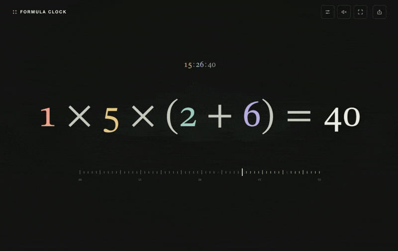

# Formula Clock

A clock that turns the hour and minute digits into an equation for the current second.



## Run locally

Install [pnpm 12.4.1](https://pnpm.io/installation). pnpm will download the required Node.js version automatically.

Clone the repository and open its directory:

```sh
git clone https://github.com/necocen/formula-clock.git
cd formula-clock
```

Install the dependencies and start the local server:

```sh
pnpm install
pnpm run dev
```

Open [http://127.0.0.1:8787](http://127.0.0.1:8787) in your browser. Keep the terminal running; press **Ctrl+C** to stop the server. Next time, just run `pnpm run dev` from the same directory.
